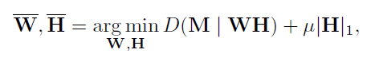
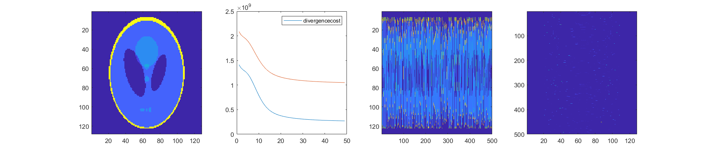
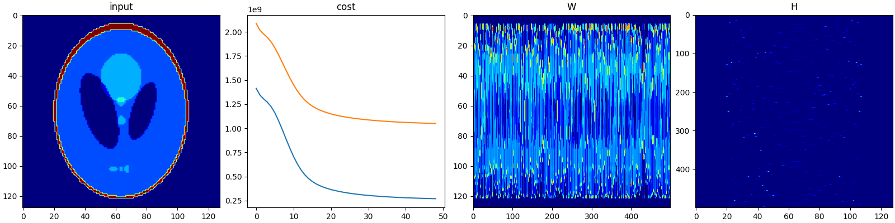

## Sparse-NMF

A python implement of Sparse-NMF based on matlab script provided in [1] and python implementation in [2]

Objective function


e.g.
```
inp_data = scipy.io.loadmat('imagedata.mat')
v = inp_data['f']

# params
r = 500  # number of bases
cf = 'kl'  # 'is', 'kl', 'ed'  # cost function
sparsity = 5  # weight for the L1 sparsity penalty
# stopping criteria
max_iter = 100
conv_eps = 1e-3
display = True
random_seed = 1

w, h, objective_div, objective_cost = sparse_nmf(
    v, cf=cf, sparsity=sparsity, max_iter=max_iter, conv_eps=conv_eps,
    display=display, random_seed=random_seed, r=r)
```

## validate
Data from [2] are used as input
- result of matlab implement

- result of this implement


## References
[1] Roux, Jonathan Le, and Felix Weninger. n.d. ‘Sparse NMF – Half-Baked or Well Done?’, 21.

[2] https://gitlab.com/padouppadoup/sparseNMF
